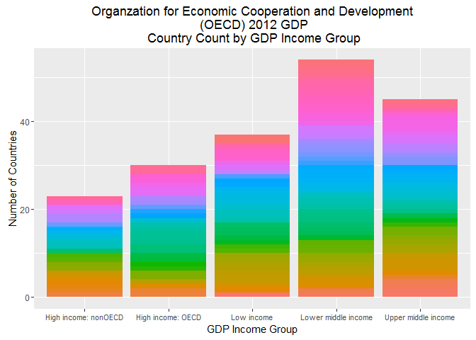

# World 2012 GDP by Country Analysis
Albert Alva  
November 7, 2016  


#Organization for Economic Co-operation and Development (OECD)
The mission of the Organization for Economic Co-operation and Development (OECD) is to promote policies that will improve the economic and social well-being of people around the world.  The do this by organizing a world trade organization of countries around the world.  
The OECD forecasts and reports the state of the world economy.  Two reports offered World GDP by Country and a report of economic aspects of countries around the world.  One measure the OECD uses to measure economic conditions is the country GDP grouped in to Income Groups that include both OECD members and non-members as well as medium and low income groups.
The rest of this document will illustrate the steps needed to answer research questions with this data.  The steps include obtaining the raw data, building tidy data and merging the data.  After this process, the data will yield information about country GDP ranking and the OECD income categories.
Data from both datasets are required to compare countries by both country income rank and country income category. The datasets were available at https://d396qusza40orc.cloudfront.net/getdata%2Fdata%2FGDP.csv.  The economic indicator data was obtained from  https://d396qusza40orc.cloudfront.net/getdata%2Fdata%2FEDSTATS_Country.csv.

Every countries gross domestic product (GDP) is recorded and grouped into income levels. This project collected the data required to answer questions about the GDP.


```r
libraries <- c('tidyr', 'repmis', 'data.table')
```


##Gathering Data
The first task in the project was to obtain the data. Gross Domestic Product data set was obtained from https://d396qusza40orc.cloudfront.net/getdata%2Fdata%2FGDP.csv. It contains Countries, World GDP Ranking and Gross Domestic Product for 2012. The income categories for the counties was obtained from https://d396qusza40orc.cloudfront.net/getdata%2Fdata%2FEDSTATS_Country.csv.
The functions used were in the package listed below.
 	repmis   
 	 R2HTML, 
 	stats, ggplot2
 	tidyr
 	 data.table. 


```r
setwd("Analysis/data")
libraries <- c('ggplot2', 'dplyr', 'lubridate', 'tidyr', 'stringr')
GDPRAW <- read.csv("https://d396qusza40orc.cloudfront.net/getdata%2Fdata%2FGDP.csv")
EDURAW <- read.csv("https://d396qusza40orc.cloudfront.net/getdata%2Fdata%2FEDSTATS_Country.csv")
write.csv(GDPRAW, "GDPRAW.csv")
write.csv(EDURAW, "EDURAW.csv")
```
###Tidy Data
This code chunk titled TidyData explains the steps to prepare the data for evaluation.

Two data set are to be written GDPORIGINAL and EDUORIGINAL. They are subsets of the original data. Both datasets where written with just the variables needed to answer the research questions. The **view()** function was used to view the raw data to decide how to cut the data.
The GDP data was imported with no headers since it contained a header and space before the data the column headings were also on seperate lines and one without a label. The data was imported without column labels and skipped the first 5 rows to strip off the header and labels. label V and the column number was temperarilly assigned to the columns Reimported the data. The EDU data was imported with headers and required little transformation beyond subsetting with the **subset()** function. The **names()** function was used to rename the variables. The **gsub("[^[:digit:]]",""** function removed commas from number fields and the  **gsub('[[:punct:] ]+** was used to eliminate punctuation from text.


```r
setwd("Analysis/data")
libraries <- c('ggplot2', 'dplyr', 'lubridate', 'tidyr', 'stringr','stats')
GDPORIGINAL <- subset(read.csv("GDPRAW.csv",skip = 5, nrows = 190 ,header = FALSE,stringsAsFactors = FALSE), select =  c(2,3,5,6))
names(GDPORIGINAL) <- c("CountryCode", "Countryrank", "Economy", "GDP")
GDPORIGINAL[!complete.cases(GDPORIGINAL),]
```

```
## [1] CountryCode Countryrank Economy     GDP        
## <0 rows> (or 0-length row.names)
```

```r
GDPORIGINAL$Countryrank <- as.numeric(GDPORIGINAL$Countryrank, na.exclude(GDPORIGINAL$Countryrank) )
GDPORIGINAL$GDP <- as.numeric(gsub("[^[:digit:]]","", GDPORIGINAL$GDP))
GDPORIGINAL$Economy <- gsub('[[:punct:] ]+','',GDPORIGINAL$Economy)
EDUORIGINAL <- subset(read.csv("EDURAW.csv",header = TRUE,stringsAsFactors = FALSE), select =  c(2,3,4,5))
names(EDUORIGINAL) <-gsub('[[:punct:] ]+','',names(EDUORIGINAL))
EDUORIGINAL <- na.omit(EDUORIGINAL)
EDUORIGINAL<- EDUORIGINAL[complete.cases(EDUORIGINAL$IncomeGroup),]
EDUORIGINAL$LongName <- gsub('[[:punct:] ]+',' ', EDUORIGINAL$LongName)
summary(GDPORIGINAL)
```

```
##  CountryCode         Countryrank       Economy               GDP          
##  Length:190         Min.   :  1.00   Length:190         Min.   :      40  
##  Class :character   1st Qu.: 48.25   Class :character   1st Qu.:    7005  
##  Mode  :character   Median : 95.50   Mode  :character   Median :   27638  
##                     Mean   : 95.49                      Mean   :  377652  
##                     3rd Qu.:142.75                      3rd Qu.:  205289  
##                     Max.   :190.00                      Max.   :16244600
```

```r
summary(EDUORIGINAL)
```

```
##  CountryCode          LongName         IncomeGroup       
##  Length:234         Length:234         Length:234        
##  Class :character   Class :character   Class :character  
##  Mode  :character   Mode  :character   Mode  :character  
##     Region         
##  Length:234        
##  Class :character  
##  Mode  :character
```

```r
write.csv(GDPORIGINAL,"GDPORIGINAL.csv")
write.csv(EDUORIGINAL,"EDUORIGINAL.csv")
```
###Merging

This step performs the analsyis on the merged data. It uses the **R2HTML** and **doby** packages to output the data. It elimiated the non matching observation. The **merge()** function was used to combine the datasets. 

```r
setwd("Analysis/data")
libraries <- c('ggplot2', 'dplyr', 'lubridate', 'tidyr', 'stringr','doBy')
GDPEDU<- merge(GDPORIGINAL,EDUORIGINAL,by.x = "CountryCode",
by.y = "CountryCode",all.x = TRUE,all.y = FALSE)
summary(GDPEDU)
```

```
##  CountryCode         Countryrank       Economy               GDP          
##  Length:190         Min.   :  1.00   Length:190         Min.   :      40  
##  Class :character   1st Qu.: 48.25   Class :character   1st Qu.:    7005  
##  Mode  :character   Median : 95.50   Mode  :character   Median :   27638  
##                     Mean   : 95.49                      Mean   :  377652  
##                     3rd Qu.:142.75                      3rd Qu.:  205289  
##                     Max.   :190.00                      Max.   :16244600  
##    LongName         IncomeGroup           Region         
##  Length:190         Length:190         Length:190        
##  Class :character   Class :character   Class :character  
##  Mode  :character   Mode  :character   Mode  :character  
##                                                          
##                                                          
## 
```

```r
GDPEDU[!complete.cases(GDPEDU),]
```

```
##     CountryCode Countryrank    Economy   GDP LongName IncomeGroup Region
## 155         SSD         131 SouthSudan 10220     <NA>        <NA>   <NA>
```

```r
#Answer 1 189 of EDU matched the 190 GDP "South Sudan" did not match
write.csv(GDPEDU,"GDPEDU.csv")
#  The merged dataset is ready for analysis
```
####How many records matched in the merge?
##### *One hundred eighty nine of EDU matched the 190 GDP, "South Sudan" did not match.*


###Analysis
The **means()** function was used to calculate the average GDP rankings. The data was ordered using the **order()** function.


```r
setwd("Analysis/data")
libraries <- c('dplyr','stringr','data.table','dtplyr','stat')
GDPEDU2 <- na.omit(GDPEDU)
GDPEDU2[!complete.cases(GDPEDU2),]
```

```
## [1] CountryCode Countryrank Economy     GDP         LongName    IncomeGroup
## [7] Region     
## <0 rows> (or 0-length row.names)
```

```r
#ordering the data set by GDP to tell the 13th from the top
#2a the 13th country on the list is St. Kitts and Nevis"
library('doBy')
GDPEDU2<-orderBy(~GDP,data=GDPEDU2)
GDPEDU2$LongName[13]
```

```
## [1] "St Kitts and Nevis"
```

```r
write.csv(GDPEDU2,"GDPEDU2.csv")
GDPEDU2 <- data.table::data.table(GDPEDU2)
#  b. What are the average GDP rankings for the "High income: OECD" and "High income: nonOECD" groups?
#attach(GDPEDU)
GDPR <- GDPEDU2[,mean(Countryrank, na.rm = TRUE), by = IncomeGroup]
names(GDPR) <- c("IncomeGroup", "AverageGDPRank")
GDPR <- GDPR[5:1]
GDPR$AverageGDPRank <- round(GDPR$AverageGDPRank, digits = 2)
names(GDPR) <- c("Income Group", "Average World Income Rank")
GDPR
```

```
##            Income Group Average World Income Rank
## 1:    High income: OECD                     32.97
## 2: High income: nonOECD                     91.91
## 3:           Low income                    133.73
## 4:  Upper middle income                     92.13
## 5:  Lower middle income                    107.70
```
####What are the average GDP rankings for the "High income: OECD" and "High income: nonOECD" groups? 
##### *The averages of the High Income OECD and NON-OECD were $32.97mm and $91.91mm respectively.*


This section outputs the table as an HTML document.

```r
setwd("Analysis/PlotsAndTables")
library(R2HTML)
HTMLSetFile("AverageGDPofIncomeGroups.html")
```

```
## [1] "AverageGDPofIncomeGroups.html"
```

```r
HTML.title("<center>Average GDP of OECD Income Groups</center>")
HTML(GDPR,"AverageGDPofIncomeGroups.html" )
HTMLEndFile("AverageGDPofIncomeGroups.html")
```
####The Plot
This section plots the number of countries in each income group.  It uses **data.table()** and **gplot()**.
<!-- -->
####Quantiles

This section calculates the quantiles with a cut function.


```r
qx <- quantile(GDPEDU2$Countryrank, probs= seq(0, 1, 0.20), na.rm = TRUE)
GDPEDU2$GdpQuantiles <- as.character(cut(GDPEDU2$Countryrank, qx, include.lowest = FALSE))
summary(GDPEDU2$GdpQuantiles)
```

```
##    Length     Class      Mode 
##       189 character character
```

```r
attach(GDPEDU2)
```

```
## The following objects are masked from myplot:
## 
##     Economy, IncomeGroup, Region
```

```r
Qd <- GDPEDU2[IncomeGroup=="Lower middle income", .N ,by=c("IncomeGroup", "GdpQuantiles")]
str(Qd)
```

```
## Classes 'data.table' and 'data.frame':	5 obs. of  3 variables:
##  $ IncomeGroup : chr  "Lower middle income" "Lower middle income" "Lower middle income" "Lower middle income" ...
##  $ GdpQuantiles: chr  "(152,190]" "(114,152]" "(76.2,114]" "(38.6,76.2]" ...
##  $ N           : int  16 9 11 13 5
##  - attr(*, ".internal.selfref")=<externalptr>
```

```r
Qd 
```

```
##            IncomeGroup GdpQuantiles  N
## 1: Lower middle income    (152,190] 16
## 2: Lower middle income    (114,152]  9
## 3: Lower middle income   (76.2,114] 11
## 4: Lower middle income  (38.6,76.2] 13
## 5: Lower middle income     (1,38.6]  5
```

```r
names(Qd$N)<-c("Count of \n Income Group")
names(Qd) <- c("Income<br>Group",  "GDP<br>Quantiles", "Count<br>Income Group")
HTMLSetFile("IncomeGroupsinHighest38.html")
```

```
## [1] "IncomeGroupsinHighest38.html"
```

```r
HTML.title("<center>IncomeGroupsinHighest38.html</center>", HR=1)
HTML(Qd)
str(Qd)
```

```
## Classes 'data.table' and 'data.frame':	5 obs. of  3 variables:
##  $ Income<br>Group      : chr  "Lower middle income" "Lower middle income" "Lower middle income" "Lower middle income" ...
##  $ GDP<br>Quantiles     : chr  "(152,190]" "(114,152]" "(76.2,114]" "(38.6,76.2]" ...
##  $ Count<br>Income Group: int  16 9 11 13 5
##  - attr(*, ".internal.selfref")=<externalptr>
```

```r
HTMLEndFile()
```
#Conclusion
The data provided information concerning the Worlds nation’s economies in 2012.  The graph shows membership of income group categories.  It shows the lower middle income group had the highest representation with, 54 countries followed by lower middle income, low income, non-OECD and  OECD high income groups, 45,37,30 and 23.  This information must be studied carefully to understand how the High GDP Non-OECD could have a higher average rank then the high income OECD countries, 91.91 and 32.97 respectively.  This especially interesting since the OECD counties outperform Non- OECD high income countries by $1,379,567 mm.
On the other end of the income distribution, the lower middle income group counties are outperforming Non-OECD counties with an average GDP of $256,663mm as compared to the high income non-OECD groups average GDP of $104,350mm.  But there are 54 middle low income countries compared to only 23 high income non-OECD group.  Further, the lower middle income group had 16 members in the top 20% of world ranking.  
Tracking and forecasting world GDP had many facets to consider other than just GDP when comparing a countries success.
